# Architecture Diagrams (Mermaid)

## 1. System Architecture Overview

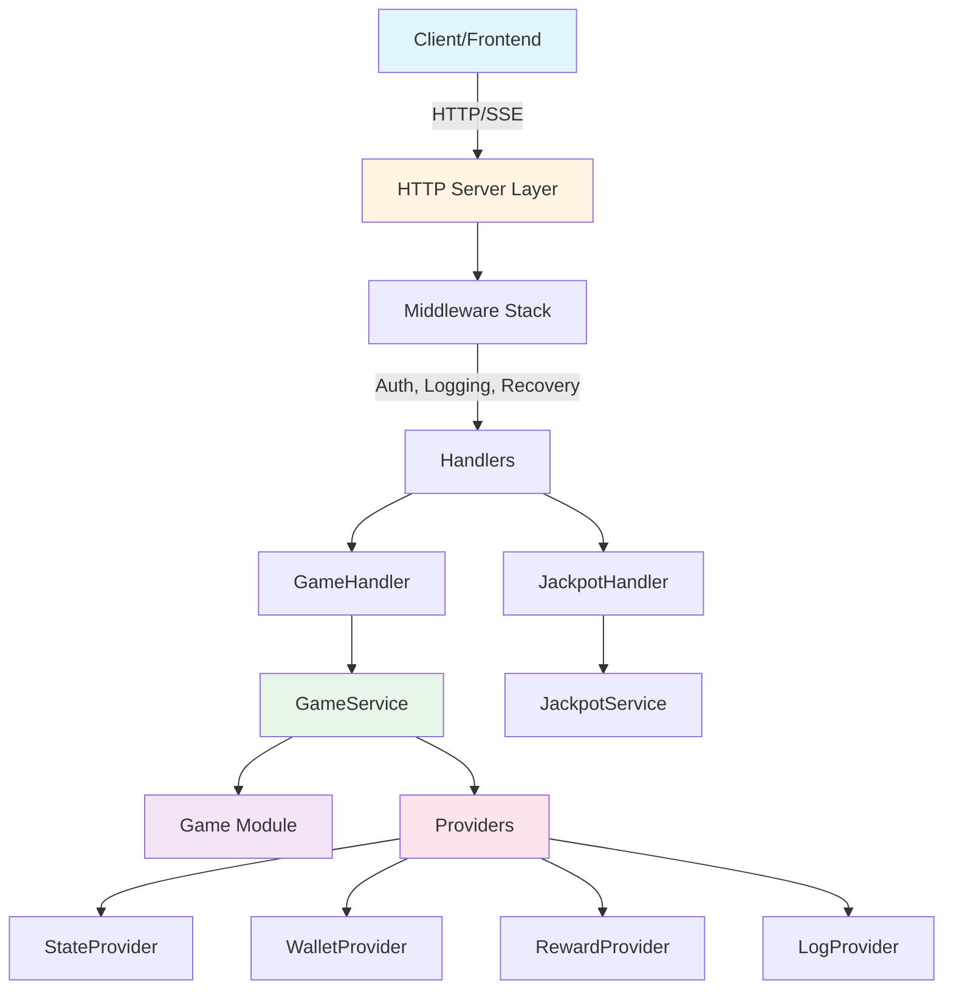

## 2. Spin Flow (Normal Spin)

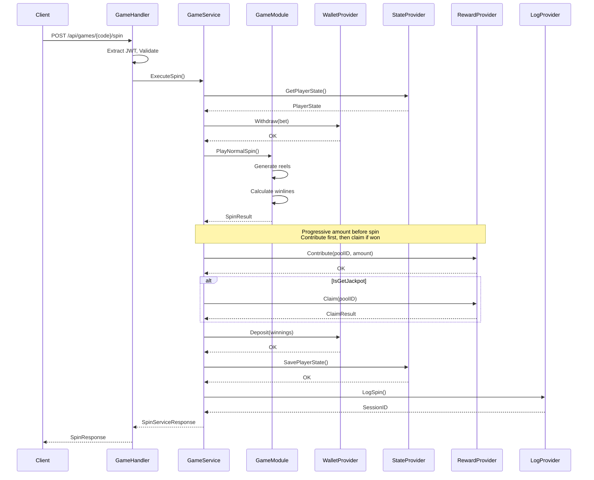

## 3. Free Spin Flow

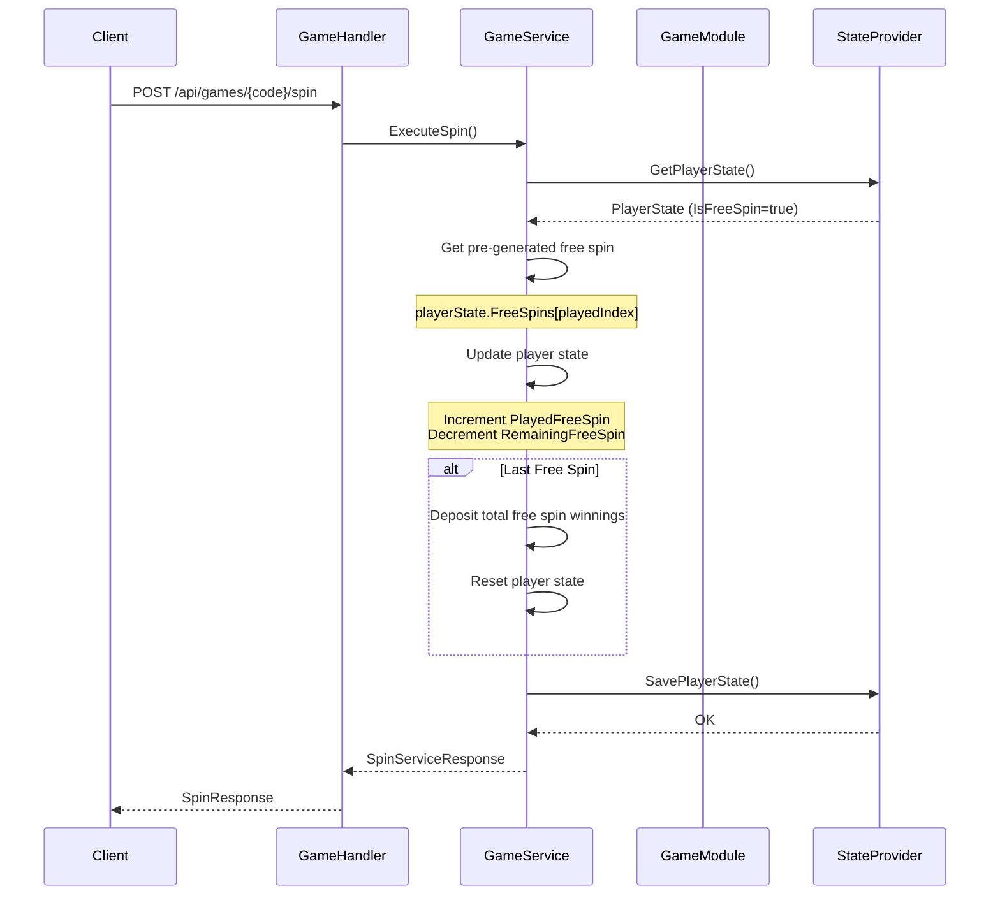

## 4. Free Spin Trigger Flow

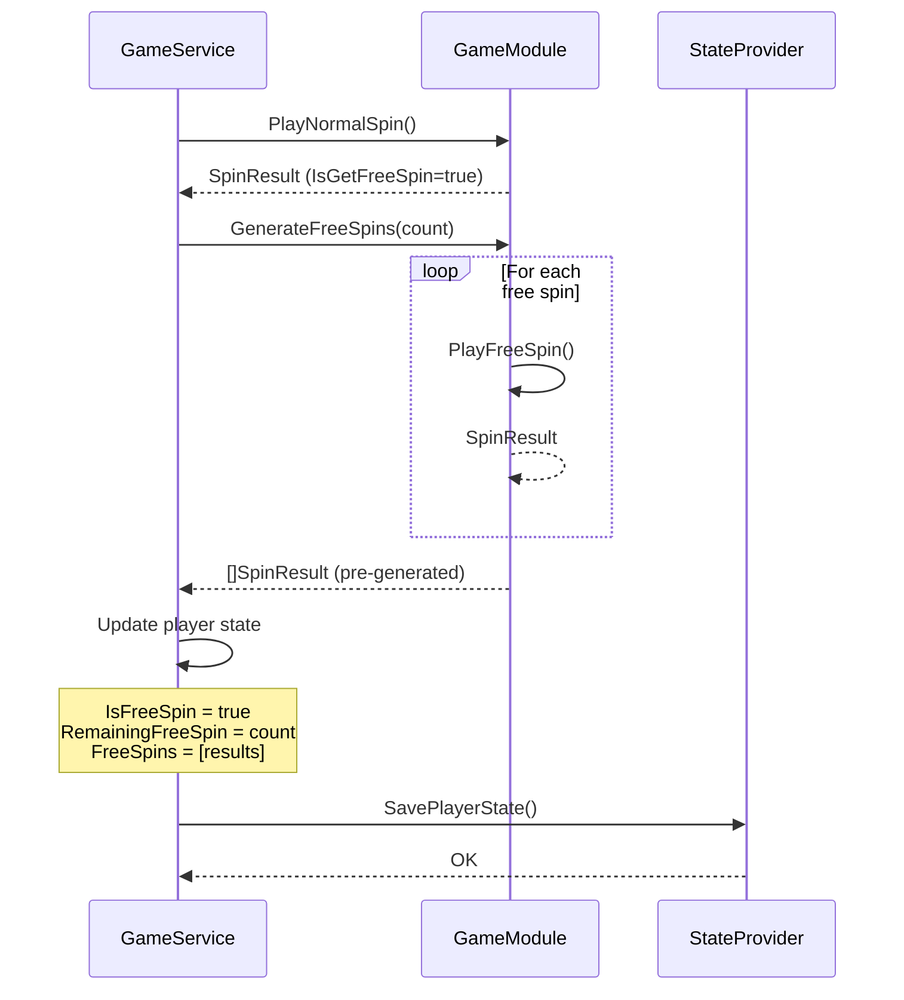

## 5. Jackpot Flow

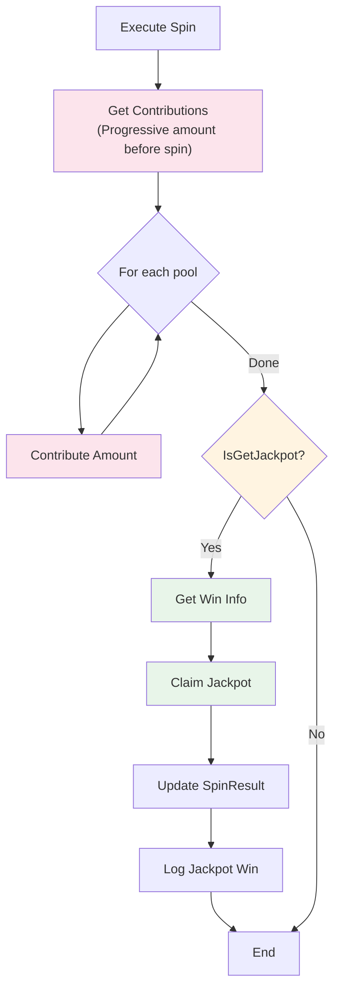

## 6. Jackpot SSE Stream Flow

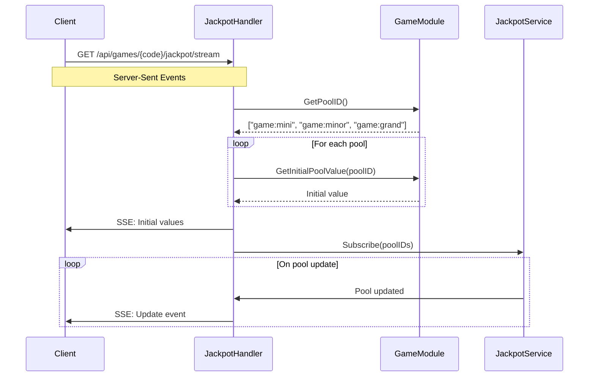

## 7. Module Interface Structure

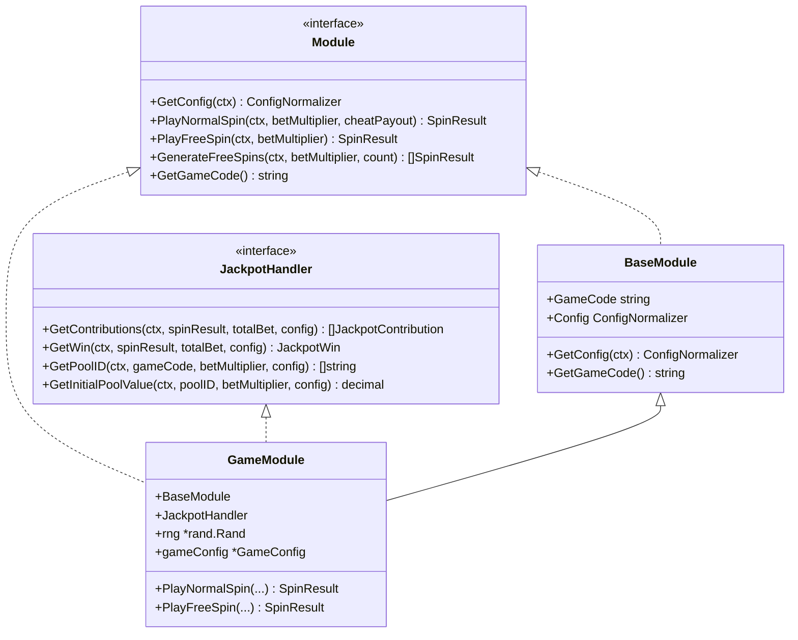

## 8. Provider Interfaces

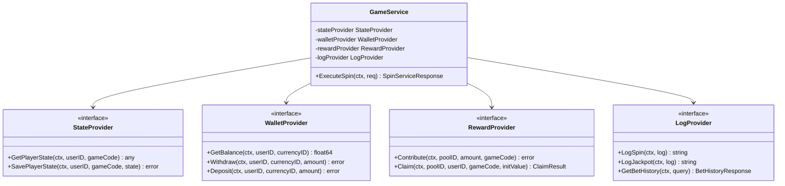

## 9. Data Flow

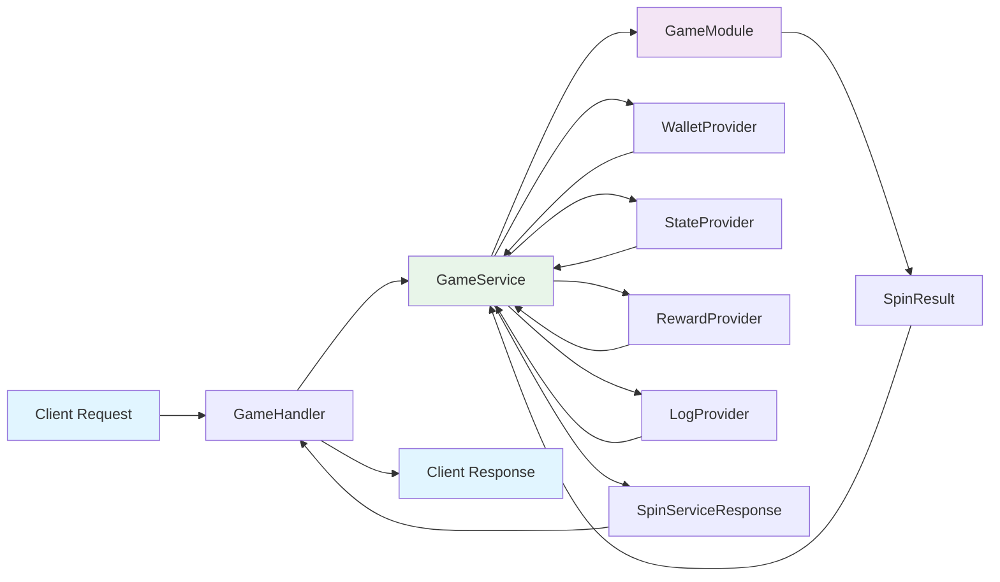

## 10. Error Handling Flow

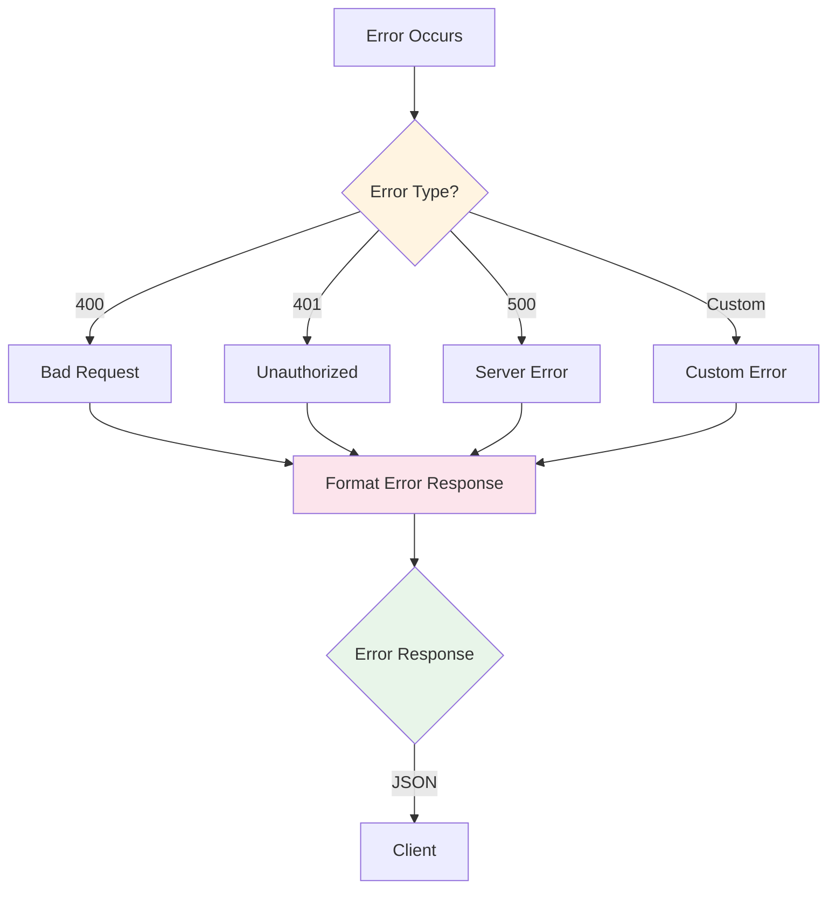

## 11. Configuration Loading

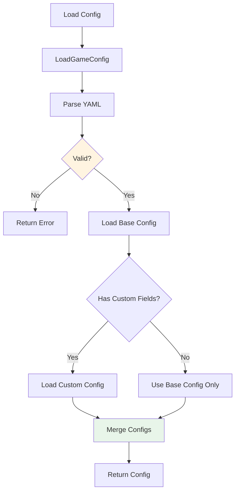

## 12. Game Registration Flow

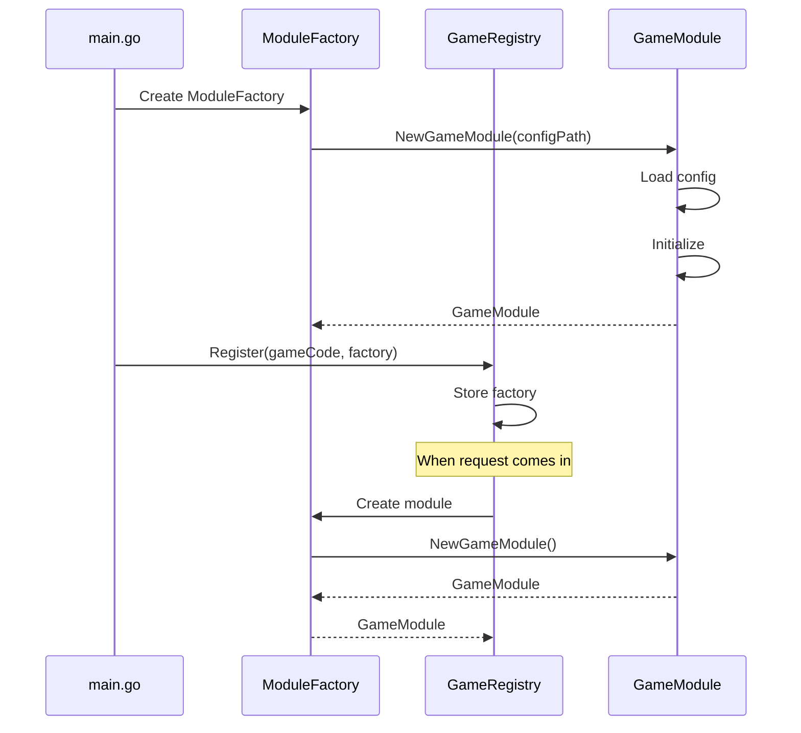

## 13. CLI Flow - Create Project

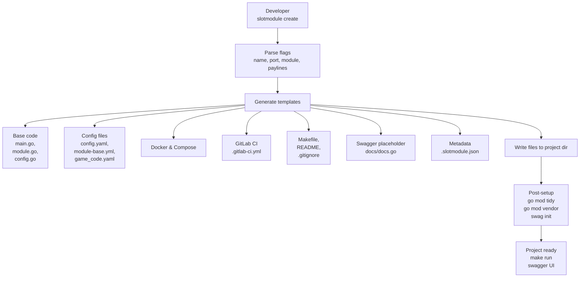

## 14. CLI Flow - Update Project

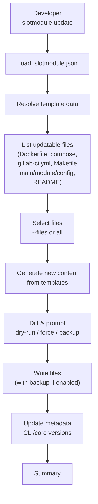

